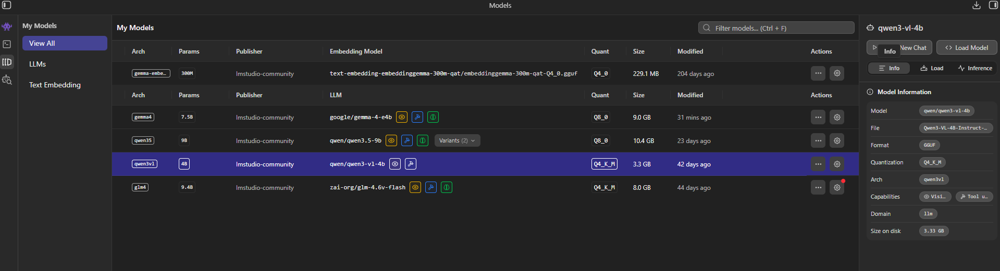
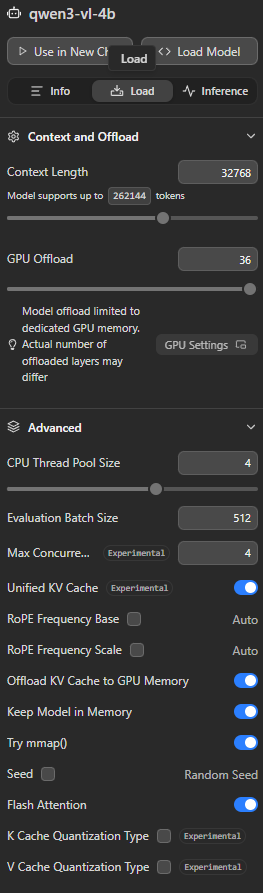
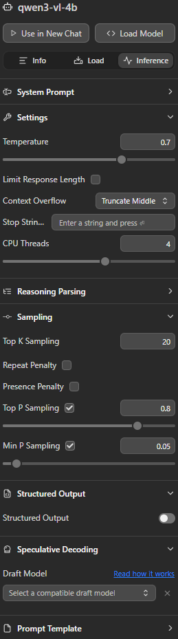
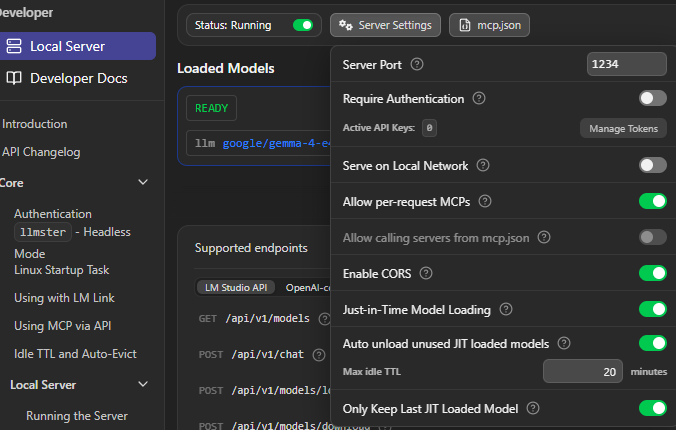

# Assistant V2 Web Portable Bundle

This folder is a self-contained copy of the files needed to run `assistant_v2_web.py`
on another Windows PC.

Included:
- `assistant_v2_web.py`
- `assistant.py`
- `.env.example`
- `requirements.txt`
- `certs/openssl.cnf`

Not included:
- local virtual environments
- model caches
- generated TLS certificate/key files
- machine-specific audio device names

Notes:
- `assistant_v2_web.py` loads `.env` from this folder.
- `setup.ps1` creates local `.env` from `.env.example` if `.env` is missing.
- It also looks for `certs/cert.pem` and `certs/key.pem` in this folder for auto HTTPS.
- Those cert files are intentionally not copied here because they should be generated per machine.
- Package/model downloads are stored in this bundle's local `.cache` folder so they can be removed safely.
- LM Studio is still an external dependency. It must be installed separately, running, and serving the model named in `.env`.
- Python requirement for this bundle is `>= 3.10 and < 3.13`.
- `setup.ps1` reuses a compatible local Python if found, otherwise it downloads and installs Python `3.12.10` from `python.org` automatically.

## First Use On A New PC

1. Install LM Studio on that PC.
2. Download or load the chat model named in `.env`:
   - default: `qwen/qwen3-vl-4b`
3. Make sure LM Studio is running and its OpenAI-compatible server is enabled at:
   - `http://localhost:1234/v1`
4. Open PowerShell in this folder.
5. Run setup:

```powershell
.\setup.ps1
```

6. Start the web assistant:

```powershell
.\start.ps1
```

7. Wait until `LAN UI: https://<your-lan-ip>:8765` is printed in terminal, then open exactly that URL from the phone/device you want to use.
8. If microphone permission is blocked, trust the generated local certificate on that device/browser.

## Optional Configuration

- Change the model name in `.env` if the new PC uses a different LM Studio model:
  - `LM_STUDIO_MODEL=...`
- If the new PC has no working CUDA setup, keep:
  - `WHISPER_DEVICE=auto`
- If you want different Kokoro voices, change:
  - `KOKORO_VOICE=...`
- If you want to skip preloading large model downloads during setup:

```powershell
.\setup.ps1 -SkipModelPreload
```

Setup:

```powershell
.\setup.ps1
```

Start:

```powershell
.\start.ps1
```

What setup does:
- checks for compatible Python `>= 3.10 and < 3.13`
- downloads and installs Python `3.12.10` automatically if no compatible Python exists
- recreates `.venv` if it was built with an incompatible Python version
- creates `.venv` if missing
- installs packages from `requirements.txt`
- stores package/model caches under local `.cache`
- generates local `certs\cert.pem` and `certs\key.pem` if missing
- optionally preloads Whisper and Kokoro downloads

Uninstall:

```powershell
.\uninstall.ps1
```

What uninstall removes:
- `.venv`
- `.env`
- `.cache`
- `output`
- generated `certs\cert.pem` and `certs\key.pem`
- local `__pycache__`
- temporary Python installer download under `%TEMP%\assistant-v2-web-portable-bootstrap`

What uninstall does not remove:
- LM Studio
- any globally installed Python
- caches outside this bundle folder

Optional uninstall flags:
- keep `.env`:

```powershell
.\uninstall.ps1 -KeepEnvFile
```

- keep generated HTTPS cert/key:

```powershell
.\uninstall.ps1 -KeepCerts
```

Phone/browser HTTPS note:
- mobile microphone permission usually requires HTTPS
- the generated cert is local to that PC and is not meant to be committed to Git
- you may need to trust that cert on the phone/browser before microphone access works
- Android usually accepts this after installing/trusting the cert
- iPhone/iPad may require enabling full trust after installing the cert

Startup and first-download behavior:
- when the server starts correctly, terminal output includes both:
  - `Web UI: https://127.0.0.1:8765`
  - `LAN UI: https://<your-lan-ip>:8765`
- from another device, use the `LAN UI` address (not `127.0.0.1`)
- keep the terminal open while using the assistant
- during first model download, do not stop the terminal; wait until setup/start finishes
- if startup exits and you do not see `Web UI`/`LAN UI`, startup failed and should be retried

Conversation behavior:
- each device/browser keeps an ongoing conversation context
- the assistant continues that same conversation until you press `New Round`
- pressing `New Round` resets the conversation history for that client

About the Hugging Face symlink warning:
- this warning is about Windows symlink support in cache folders
- it is usually non-fatal; download still works, but cache may use more disk
- this bundle disables that warning by default in setup/start scripts

## LM Studio Model Settings (Screenshots)

Screenshots used for this setup:

- `01-model-info.png`
- `02-context-and-offload.png`
- `03-inference-settings.png`
- `04-server-settings.png`





